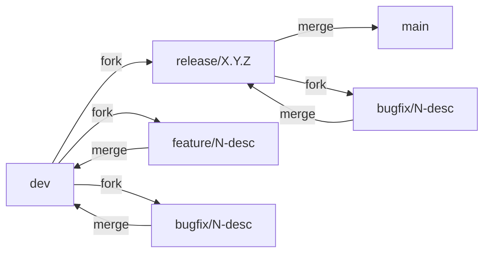
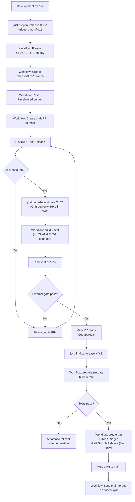

# Release Cycle and Branching Strategy

This document defines the release workflow, branching strategy, and automation for the vigOS devcontainer project.

## Table of Contents

- [Branching Strategy](#branching-strategy)
- [Release Workflow Overview](#release-workflow-overview)
- [Detailed Release Steps](#detailed-release-steps)
- [Scripts and Tools](#scripts-and-tools)
- [CI/CD Integration](#cicd-integration)
- [QMS and Compliance](#qms-and-compliance)
- [Troubleshooting](#troubleshooting)
- [Best Practices](#best-practices)
- [References](#references)

---

## Branching Strategy

### Branch Hierarchy



### Branch Types

| Branch Type | Naming Convention | Purpose | Base Branch | Merge Target |
|-------------|-------------------|---------|-------------|--------------|
| **main** | `main` | Production releases only | N/A | N/A |
| **dev** | `dev` | Integration branch for development | N/A | `main` (via release) |
| **release** | `release/X.Y.Z` | Release preparation and testing (write-protected) | `dev` | `main` |
| **feature** | `feature/N-description` | New features, enhancements | `dev` | `dev`  |
| **bugfix** | `bugfix/N-description` | Bug fixes | `dev` or `release/X.Y.Z` | `dev` or `release/X.Y.Z` |

### Branch Protection Rules

- **main**: Requires PR with approval, all CI checks must pass
- **dev**: Requires PR
- **release/X.Y.Z**: Requires PR

### Topic Branch Naming and Workflow

Topic branches follow one of these patterns:

- **Issue-tied:** `<type>/<issue-number>-<short-summary>` (for feature, bugfix, release)
- **Maintenance:** `chore/<short-summary>` (for routine tasks, no issue required)

**Branch Types:**

| Type | Issue Required | Use for |
|------|---|---------|
| **feature** | Yes | New functionality, enhancements |
| **bugfix** | Yes | Bug fixes (non-urgent) |
| **release** | Yes | Release preparation, version bumps, release notes |
| **chore** | No | Maintenance tasks, syncing branches, dependency updates |

**Examples:**
- `feature/48-release-automation`
- `bugfix/52-fix-changelog-parsing`
- `chore/sync-main-to-dev`
- `chore/update-dependencies`

**Creating a Development Branch for an Issue:**

When starting work on a GitHub issue:

1. Verify no developer branch is linked yet: `gh issue develop --list <issue_number>`
2. Pick a branch type from: feature, bugfix, release
3. Use a kebab-case short summary from the issue title (a few words, omitting prefixes like "Add")
4. Create and link via GitHub: `gh issue develop <issue_number> --base dev --name <branch_name> --checkout`
5. Ensure local branch is up to date: `git pull origin <branch_name>`

**Creating a Chore Branch:**

For routine maintenance tasks that don't correspond to a specific issue:

```bash
# Create and checkout a chore branch
git checkout -b chore/<short-summary> dev

# Make changes, commit, and push
git add .
git commit -m "chore: description of maintenance task"
git push -u origin chore/<short-summary>

# Create PR for review
gh pr create --base dev --head chore/<short-summary>
```

---

## Release Workflow Overview

### Release Lifecycle



### Release Phases

1. **Preparation** (`prepare-release`): Freeze CHANGELOG on dev, create release branch, reset Unreleased on dev, open draft PR
2. **Review & Testing**: CI validation, fix issues, publish candidates to verify; mark PR ready and get approvals last (this is the final-release gate, not the candidate gate)
3. **Candidate Publish** (`publish-candidate`): Build/test/publish `X.Y.Z-rcN` and dispatch cross-repo validation workflow
4. **Cross-Repo Validation**: Smoke-test runs asynchronously after candidate and final publish; see `docs/CROSS_REPO_RELEASE_GATE.md`. Before promotion, **`promote-release.yml`** requires a published **final** (non-draft, non-prerelease) GitHub Release for the version tag on `devkit-smoke-test` so human acceptance downstream is reflected before `:latest` and the draft release are published.
5. **Finalization & Post-Release**: Publish final image/tag, open a **draft** GitHub Release for human review, then merge PR to `main` and let sync automation update `dev`
6. **Promote & cleanup**: `promote-release.yml` updates `:latest`, publishes the draft release, merges the release PR, then runs a **best-effort** cleanup job (Refs [#463](https://github.com/vig-os/devcontainer/issues/463), [#583](https://github.com/vig-os/devcontainer/issues/583)): deletes GHCR RC image versions for `${VERSION}-rc*` (per-arch tags included) and matching RC cosign signatures, and deletes remote git RC tags for that base version when **no** GitHub Release is linked. GHCR deletes use **`GITHUB_TOKEN`** with **repo Admin** on the `devcontainer` package (see [Registry and cleanup tokens](#registry-and-cleanup-tokens-upstream)); the cleanup step fails loudly when RC tags remain. The cleanup job uses `continue-on-error`, so promote still completes. **Before this cleanup runs, migrate any consumers still pinned to an RC tag** (via `DEVCONTAINER_VERSION` in their `.vig-os` file) **to the final tag** — see [Phase 5](#phase-5-post-release-cleanup) ([#880](https://github.com/vig-os/devcontainer/issues/880)).

## Immutable releases, tag rulesets, and forward-fix policy

This section applies to **`vig-os/devcontainer`** (this repo) and, for matching supply-chain posture, **`vig-os/devkit-smoke-test`**. It does **not** describe release workflows in consumer projects; those are documented in [Downstream release workflows](DOWNSTREAM_RELEASE.md).

**GitHub immutability (organization settings):** With **immutable releases** enabled, a **published** GitHub Release (including a published **pre-release**) locks its **linked** tag and release assets. A git tag with **no** linked published release is **not** immutable via that feature. **Tag rulesets** are separate: they can restrict creating, updating, or deleting tags regardless of releases.

**Policy (behavior in [`.github/workflows/release.yml`](../.github/workflows/release.yml) for this repository):**

- **Final releases (`X.Y.Z`)**: After build/publish, automation creates a **draft** GitHub Release (see GitHub’s [immutable releases](https://docs.github.com/en/code-security/concepts/supply-chain-security/immutable-releases) and [draft-first best practice](https://docs.github.com/en/code-security/concepts/supply-chain-security/immutable-releases#best-practices-for-publishing-immutable-releases)). A human **publishes** the draft from the **Releases** UI when satisfied; with **immutable releases** enabled, **publishing** makes the linked tag and assets immutable.
- **Candidates (`X.Y.Z-rcN`)**: Candidate mode creates and pushes the **git tag**, publishes **GHCR** images (and related signing/attestations), and triggers smoke-test dispatch. It does **not** create a GitHub **Release** object for the RC—only **final** runs use `gh release create` (as a draft). The RC tag is therefore **not** locked by immutable releases until/unless you add a published release or a tag ruleset applies.
- **Forward-fix (automation)**: Rollback **does not** delete remote tags—this is a **workflow choice** to avoid rewriting history, not GitHub declaring the tag immutable. Recovery is **forward-fix** (new RC, then final when ready). If a retry publishes the same tag, the workflow skips re-creating the tag when it already points at the finalized commit.
- **Post-promote RC cleanup**: After a successful **`promote-release`** merge to `main`, automation may delete stale **git** RC tags (only when no GitHub Release is associated) and matching **GHCR** RC package versions for that base semver; see step 6 under [Release Phases](#release-phases). Tags tied to a published or draft GitHub Release are not removed by this job.
- **Repository settings** (manual; not stored in git): enable **immutable releases** and **tag rulesets** as appropriate for `vig-os/devcontainer` and `vig-os/devkit-smoke-test`. See GitHub: [Preventing changes to your releases](https://docs.github.com/en/code-security/supply-chain-security/understanding-your-software-supply-chain/preventing-changes-to-your-releases). Use **RELEASE_APP** in bypass lists only where tag creation requires it.

---

## Detailed Release Steps

### Phase 1: Preparation

**Prerequisites:**
- All planned features merged to `dev`
- All tests passing on `dev`
- CHANGELOG Unreleased section has content

**Execute:**

```bash
# Trigger the prepare-release workflow via GitHub Actions
just prepare-release X.Y.Z

# Or directly via GitHub CLI:
gh workflow run prepare-release.yml --ref dev -f "version=X.Y.Z"
```

**What the workflow does (automatically):**

The `prepare-release.yml` workflow freezes the CHANGELOG on dev and creates the release branch:

1. ✅ **Validate** job (runs first)
   - Validates semantic version format (X.Y.Z)
   - Verifies release branch `release/X.Y.Z` doesn't exist (local or remote)
   - Verifies tag `X.Y.Z` doesn't already exist
   - Verifies CHANGELOG has `## Unreleased` section with content
   - Confirms dev branch is checked out

2. ✅ **Prepare** job (skipped if --dry-run)
   - Runs `prepare-changelog prepare` → moves Unreleased content to `## [X.Y.Z] - TBD` + creates fresh empty Unreleased section
   - Commits prepared CHANGELOG to `dev` via API (single atomic commit — dev never loses `## Unreleased`)
   - Creates `release/X.Y.Z` branch from that dev commit (the empty Unreleased is kept — see [#590](https://github.com/vig-os/devcontainer/issues/590))
   - Creates draft PR to `main` with CHANGELOG content as body

**CHANGELOG state after prepare-release:**
- `dev`: `## Unreleased` (empty) + `## [X.Y.Z] - TBD` (with content)
- `release/X.Y.Z`: `## Unreleased` (empty) + `## [X.Y.Z] - TBD` (with content)

The empty `## Unreleased` is never stripped ([#590](https://github.com/vig-os/devcontainer/issues/590)): it is present on both dev and release/main as stable common context in the freeze commit that becomes the main↔dev merge base, so the sync merge keeps `## Unreleased` instead of silently dropping it.

**Output example:**

```
✓ Release branch prepared successfully!

Release Summary:
  Version: 1.0.0
  Branch: release/1.0.0

CHANGELOG state:
  dev:     ## Unreleased (empty) + ## [1.0.0] - TBD
  release: ## Unreleased (empty) + ## [1.0.0] - TBD

Next steps:
  1. Test release: git checkout release/1.0.0
  2. Review draft PR and monitor CI
  3. Fix any issues via bugfix PRs to release/1.0.0
  4. Publish candidates to verify: just publish-candidate 1.0.0 (repeat as needed)
  5. Mark PR as ready for review (gh pr ready <PR_NUMBER>)
  6. Get PR approval from reviewer
  7. Final release: just finalize-release 1.0.0
```

**Key characteristics:**

- **Consistent environment**: Runs on CI runner, not dependent on local tooling
- **Audit trail**: All actions logged in GitHub Actions
- **CI triggering**: Push via GitHub App token triggers CI on release branch automatically
- **No interactive prompts**: Workflow fails if CHANGELOG Unreleased section is missing or empty (no user prompts)
- **Reproducible**: Same behavior regardless of developer's local setup
- **Atomic CHANGELOG**: Dev never enters a state without `## Unreleased`

### Phase 2: Review & Testing

This is the main quality gate. The release branch and draft PR serve as the coordination point.

**Activities:**

1. **Review CHANGELOG**
   - Verify all changes since last release are documented
   - Check issue references are correct
   - Ensure descriptions are clear

2. **CI Testing**

   CI runs automatically on these `pull_request` events:
   - When the draft PR from the release branch to `main` is created (by `prepare-release`)
   - When new commits land on the release branch (e.g., merged bugfix PRs), which synchronize the open PR

   Monitor CI status:

   ```bash
   # Check recent CI runs on release branch
   gh run list --branch release/1.0.0 --workflow ci.yml

   # View specific run details
   gh run view <RUN_ID>

   # Watch a running workflow
   gh run watch <RUN_ID>

   # Optional: Manually trigger CI if needed
   gh workflow run ci.yml --ref release/1.0.0
   ```

3. **Publish Candidates to Verify** (as needed)

   Release candidates are the verification vehicle. Publish one whenever you
   want to exercise the actual built image:

   ```bash
   # Infers the next X.Y.Z-rcN automatically
   just publish-candidate 1.0.0
   ```

   Candidate dispatch gates on **CI only** — the PR may stay a draft and need
   not be approved yet ([#902](https://github.com/vig-os/devcontainer/issues/902)).
   RCs are disposable: auto-incrementing `rcN` tags that never touch `:latest`,
   create no GitHub Release, and are pruned at promote. Iterate freely until the
   image behaves as intended.

4. **Local Testing** (optional)

   ```bash
   # Check out release branch
   git checkout release/1.0.0

   # Run tests locally
   just test

   # Build container locally (optional)
   just build
   ```

5. **Fix Issues**

   All fixes must go through bugfix branches (release branch is write-protected):

   ```bash
   # Create bugfix branch from release
   git checkout -b bugfix/N-fix-description release/1.0.0

   # Make fixes...
   git add .
   git commit -m "fix: issue description

   Refs: #N"

   # Test locally
   just build
   just test

   # Push and create PR to release branch
   git push origin bugfix/N-fix-description
   gh pr create --base release/1.0.0 --head bugfix/N-fix-description

   # Request review, address feedback
   # After PR is approved and merged:
   # - CI runs automatically on release branch
   # - Monitor: gh run list --branch release/1.0.0

   # Continue testing on release branch
   ```

6. **Request Reviews**
   - Add reviewers to the PR in GitHub UI
   - Address feedback
   - Iterate until approved

7. **Mark Ready for Review & Get Approval** (gate into finalization)

   Once the candidate behaves correctly and the CHANGELOG is settled, promote
   the PR out of draft and collect approval — this is the gate the **final**
   release enforces (candidates do not):

   ```bash
   # Removes draft status (or use the "Ready for review" button in the UI)
   gh pr ready <PR_NUMBER>
   ```

   Because this happens last, the approval lands on the exact diff that ships,
   not an intermediate one.

**Iteration:** Repeat steps 3-6 until the candidate is verified and reviewers
approve, then do step 7 once before finalizing.

### Phase 3: Finalization (GitHub Actions Workflow)

**Prerequisites** (enforced for the **final** release only; candidates in
Phase 2 require just the first bullet):
- All CI checks passed on `release/X.Y.Z`
- PR marked as ready for review (not draft)
- PR has required approvals
- No uncommitted changes

**Execute:**

```bash
# Publish final release (X.Y.Z + latest)
# Requires at least one candidate published during Phase 2.
just finalize-release X.Y.Z

# Monitor progress
gh run list --workflow release.yml
```

**What the workflow does (automatically):**

The `release.yml` workflow performs the entire remaining release process. Behavior differs by release kind:

1. ✅ **Validate** job (runs first)
   - Validates semantic version format
   - Checks release branch exists
   - Verifies CHANGELOG has `## [X.Y.Z] - TBD`
   - For **final**: allows an existing **draft** GitHub Release for the publish tag (retry path); rejects a **published** (non-draft) release for the same tag
   - Confirms PR exists and CI passed; for **final** also requires it to be not draft and approved (candidates skip the draft/approval gate — [#902](https://github.com/vig-os/devcontainer/issues/902))
   - Records pre-finalization commit for rollback

2. ✅ **Finalize** job (skipped if --dry-run)
   - **Candidate**: No CHANGELOG changes. Outputs current release branch HEAD SHA.
   - **Final**: Sets actual release date in CHANGELOG (TBD → YYYY-MM-DD), regenerates docs from templates, commits all tracked finalization changes (dynamic file list), refreshes release PR body from finalized CHANGELOG, triggers sync-issues workflow, outputs finalized SHA.

3. ✅ **Build & Test** jobs (per-architecture, runs in parallel)
   - Builds container image as tar file
   - Runs image tests
   - Runs integration tests
   - Uploads tested image as artifact
   - If ANY test fails: entire workflow stops and triggers rollback

4. ✅ **Publish** job (runs only if all builds/tests pass)
   - Candidate mode: infers next `rcN`, creates annotated tag `X.Y.Z-rcN`, publishes candidate manifests
   - Final mode: creates annotated tag `X.Y.Z` (or skips create/push if the tag already points at the finalized commit), publishes final manifests
   - Pushes tag to origin when needed
   - Final mode only: extracts release notes from finalized `CHANGELOG.md` and creates a **draft** GitHub Release for `X.Y.Z`
   - Downloads tested images from artifacts
   - Logs in to GitHub Container Registry
   - Pushes images to GHCR with architecture-specific tags
   - Creates multi-architecture manifest `ghcr.io/vig-os/devkit:<publish-tag>`
   - Creates/updates `ghcr.io/vig-os/devkit:latest` only in final mode (and only when both architectures are built)
   - Verifies manifests exist
   - Candidate and final modes: trigger cross-repository validation dispatch with `client_payload[tag]` plus source metadata (`source_repo`, `source_workflow`, `source_run_id`, `source_run_url`, `source_sha`, `correlation_id`)

5. ✅ **Rollback** job (runs if ANY job failed among validate/finalize/build-and-test/publish)
   - Resets release branch to pre-finalization state (best-effort)
   - Does **not** delete tags (forward-fix policy)
   - Creates GitHub issue with failure details and forward-fix guidance

**Output example:**

```
✓ Release workflow triggered for version 1.0.0
Monitor progress: gh run list --workflow release.yml

[Workflow runs...]

✓ Release published successfully!

Release Summary:
  Base Version: 1.0.0
  Release Kind: final
  Tag: 1.0.0
  Images:
    - ghcr.io/vig-os/devkit:1.0.0
    - ghcr.io/vig-os/devkit:latest
```

**Key characteristics:**

- **Earlier validation**: All checks happen at the start in CI
- **Safer workflow**: Tag is created AFTER successful build/test, not before
- **Automatic rollback**: Failed releases roll back the release branch; tags are not deleted (forward-fix policy, independent of whether GitHub immutability applies)—recover with a new RC or a careful final retry per docs above
- **Audit trail**: All steps are recorded in GitHub Actions logs with actor information
- **Reproducible**: Uses consistent CI environment, not dependent on local tooling

### Phase 4: Cross-Repo Validation Gate (automated)

Cross-repository validation gate rationale, mechanics, payload contract, and pass/fail interpretation are documented in `docs/CROSS_REPO_RELEASE_GATE.md`.

### Phase 5: Post-Release Cleanup

**This repository (`vig-os/devcontainer`) — manual promote path:**

1. Verify the workflow run succeeded and smoke-test dispatch completed as expected.
2. **Migrate RC-pinned consumers to the final tag** ([#880](https://github.com/vig-os/devcontainer/issues/880)): consumers pin the devcontainer image via their `.vig-os` file (`DEVCONTAINER_VERSION=X.Y.Z-rcN`). The **`cleanup`** job ("Cleanup RC artifacts") in `promote-release.yml` deletes all `X.Y.Z-rc*` git tags and GHCR image versions, so any consumer still pinned to an RC (e.g. field-validation repos) can no longer pull its image. Bump those pins to `DEVCONTAINER_VERSION=X.Y.Z` before running promote (preferred), or immediately after — the RC images and tags are gone once the cleanup job has run.
3. After smoke-test has published its **final** GitHub Release for `X.Y.Z`, run **`promote-release.yml`** (e.g. `just promote-release X.Y.Z`), which updates GHCR `:latest`, publishes the draft release, merges the release PR, and runs best-effort RC cleanup. See [Release Phases](#release-phases) step 6 and [`docs/CROSS_REPO_RELEASE_GATE.md`](CROSS_REPO_RELEASE_GATE.md).

**Consumer projects** using templates from `assets/workspace/` follow [Downstream release workflows](DOWNSTREAM_RELEASE.md): final `release.yml` leaves a **draft** GitHub Release; run **`promote-release.yml`** (or `just promote-release X.Y.Z`) to publish the release and merge to `main` (no upstream GHCR/smoke-test gate in that template).

**Legacy manual steps** (if not using promote automation):

1. Open **Releases** in GitHub, review the **draft** release for `X.Y.Z`, and **Publish** it when ready (with **immutable releases** enabled, **publishing** is what locks the linked tag and assets).
2. Merge the release PR to `main`.

```bash
# Verify release workflow succeeded
gh run list --workflow release.yml --limit 1

# Merge PR
gh pr merge <PR_NUMBER> --merge
```

**What the `sync-main-to-dev.yml` workflow does (automatically on push to main):**

Any push to `main` (including PR merges) triggers the `sync-main-to-dev.yml` workflow, which creates a PR to sync main into dev:

1. ✅ **Check** -- Early exit if dev already contains all main commits
2. ✅ **Sync** -- Creates a PR from a disposable `chore/sync-main-to-dev-*` branch into dev:
   - Checks for existing open sync PR (skips if one exists)
   - Cleans up stale sync branches without open PRs
   - Detects merge conflicts via trial merge
   - Creates sync branch from main via API
   - Opens PR to dev (with `merge-conflict` label + resolution instructions if conflicts)
   - Enables auto-merge for conflict-free PRs

No CHANGELOG reset is needed -- dev already has `## Unreleased` from the prepare-release step. The sync simply brings the finalized `[X.Y.Z] - YYYY-MM-DD` from main, which merges cleanly because both branches share the `[X.Y.Z]` section as a common ancestor.

**Verify release is published:**

```bash
# List the tag
git tag | grep 1.0.0

# Verify images in registry
docker pull ghcr.io/vig-os/devkit:1.0.0
docker pull ghcr.io/vig-os/devkit:latest

# Check manifests
docker buildx imagetools inspect ghcr.io/vig-os/devkit:1.0.0
```

---

## Scripts and Tools


### prepare-changelog

**Location:** `packages/vig-utils/src/vig_utils/prepare_changelog.py` (installed as `prepare-changelog` CLI)

**Purpose:** Multi-action CHANGELOG management tool

**Actions:**

#### `prepare VERSION [FILE]`
Move Unreleased content to `[VERSION] - TBD` section and create fresh empty Unreleased section. Used by `prepare-release.yml` to freeze the CHANGELOG on dev.

```bash
uv run prepare-changelog prepare 1.0.0 [CHANGELOG.md]
```

#### `validate [FILE]`
Validate CHANGELOG has Unreleased section with content. Used by `prepare-release.yml` to ensure there are changes to release.

```bash
uv run prepare-changelog validate [CHANGELOG.md]
```

#### `reset [FILE]`
Create fresh Unreleased section when one doesn't exist. **Safety:** Fails if Unreleased section already exists.

```bash
uv run prepare-changelog reset [CHANGELOG.md]
```

#### `finalize VERSION DATE [FILE] [--github-repository OWNER/REPO]`
Replace TBD with the release date and add a markdown link on the version heading to `https://github.com/OWNER/REPO/releases/tag/VERSION`. Used by `release.yml` (final releases only). In Actions the slug comes from `GITHUB_REPOSITORY`; locally pass `--github-repository` after the file path (or export `GITHUB_REPOSITORY`).

```bash
uv run prepare-changelog finalize 1.0.0 2026-02-11 [CHANGELOG.md]
uv run prepare-changelog finalize 1.0.0 2026-02-11 CHANGELOG.md --github-repository my-org/my-repo
```

**Tests:** `packages/vig-utils/tests/test_prepare_changelog.py`

### Justfile Recipes

**Location:** `justfile`

**Release-related recipes:**

```bash
# Prepare release branch
just prepare-release X.Y.Z

# Publish next release candidate (X.Y.Z-rcN)
just publish-candidate X.Y.Z

# Finalize release (X.Y.Z + latest)
just finalize-release X.Y.Z

# Reset CHANGELOG after release
just reset-changelog
```

---

## CI/CD Integration

### Workflow Architecture

The release process uses five coordinated workflows:

### GitHub App Configuration

Release automation relies on two GitHub Apps with different scopes:

| App | Secrets | Permissions | Used by | Purpose |
|-----|---------|-------------|---------|---------|
| **RELEASE_APP** | `RELEASE_APP_CLIENT_ID`, `RELEASE_APP_PRIVATE_KEY` | Contents read/write, Issues read/write, Pull requests read/write, Actions read/write | `release.yml`, `prepare-release.yml`, `sync-main-to-dev.yml`, `promote-release.yml` | Release operations, PR creation/updates, rollback, cross-repo dispatch, and **promote-release** git RC tag cleanup (tag-ruleset bypass) |
| **COMMIT_APP** | `COMMIT_APP_CLIENT_ID`, `COMMIT_APP_PRIVATE_KEY` (`COMMIT_APP_ID` still required by `vig-os/sync-issues-action` in `sync-issues.yml`) | Contents read/write, Issues read, Pull requests read | `sync-issues.yml`, `sync-main-to-dev.yml` | Commits to protected branches and git ref operations |

#### Registry and cleanup tokens (upstream)

- **`release.yml` (`publish`)** and **`promote-release.yml` (`validate`, `promote`)** push and inspect GHCR images using job `permissions.packages` on **`GITHUB_TOKEN`** (`docker/login-action` with `github.token`). The GitHub App token in those jobs is for git, releases, and PRs—not for registry writes.
- **`promote-release.yml` (`cleanup`, GHCR prune)** lists and deletes package versions with `gh api` against **`/orgs/vig-os/packages/container/devcontainer/versions`** using **`GITHUB_TOKEN`** (`permissions.packages: write`). Deleting org container package versions requires **Admin** on the package itself; grant it once under **Package settings → Manage Actions access → add `vig-os/devcontainer` with role Admin**. Without this grant, deletes return a misleading HTTP 404. Selection is digest-aware (RC images plus matching RC cosign signatures only; published release signatures are preserved). The step fails when deletes fail or RC tags remain; the job uses `continue-on-error`.
- **`promote-release.yml` (`cleanup`, git RC tags)** deletes remote git RC tags without a GitHub Release using **`RELEASE_APP`** (tag-ruleset bypass where configured).

Additional requirement:
- `COMMIT_APP` must be allowed in branch protection bypass rules for `dev` so sync commits can be pushed by automation.
- `RELEASE_APP` must be installed on the validation repository (`vig-os/devkit-smoke-test`) with Contents read and Actions read/write permissions so `release.yml` can send `repository_dispatch` and `repository-dispatch.yml` can trigger workflow runs there for candidate and final release validation.

#### prepare-release.yml (Release Preparation Workflow)

**Trigger:** `workflow_dispatch` (manual trigger via `just prepare-release X.Y.Z`)

**Purpose:** Freeze CHANGELOG on dev and create release branch

**Jobs (sequential):**

1. **validate** - Checks all prerequisites before creating branch
   - Validates semantic version format
   - Verifies release branch does not exist (local or remote)
   - Confirms tag doesn't already exist
   - Verifies CHANGELOG has `## Unreleased` section with content
   - Confirms dev branch is checked out
   - Outputs: version, release_branch

2. **prepare** (skipped if dry-run) - Freezes CHANGELOG and creates release branch
   - Runs `prepare-changelog prepare` (Unreleased → [X.Y.Z] - TBD + fresh empty Unreleased)
   - Commits prepared CHANGELOG to `dev` via API
   - Creates `release/X.Y.Z` branch from that dev commit (the empty Unreleased is kept, [#590](https://github.com/vig-os/devcontainer/issues/590))
   - Creates draft PR to `main` with release content

**Manual trigger (for testing):**

```bash
gh workflow run prepare-release.yml --ref dev -f "version=1.0.0" -f "dry-run=false"

# Dry-run mode (validates without making changes)
gh workflow run prepare-release.yml --ref dev -f "version=1.0.0" -f "dry-run=true"
```

**Key characteristics:**
- Provides consistent, reproducible release preparation
- Push via GitHub App token ensures CI runs on new release branch
- Audit trail in GitHub Actions logs
- No dependency on local developer environment
- Dispatch is pinned to `dev` (`--ref dev`) so workflow behavior matches the development branch
- On failure, rollback removes partial release branch state and restores `CHANGELOG.md` on `dev`

#### release.yml (Unified Release Workflow)

**Trigger:** `workflow_dispatch` (manual trigger via `just publish-candidate` or `just finalize-release`)

**Purpose:** Complete release workflow - finalize, build, test, publish, with rollback on failure

**Jobs (sequential):**

1. **validate** - Checks all prerequisites before mutations
   - Validates semantic version format
   - Validates release kind (`candidate` or `final`)
   - Computes publish tag (`X.Y.Z-rcN` for candidate, `X.Y.Z` for final)
   - Verifies release branch exists
   - Checks CHANGELOG has `[X.Y.Z] - TBD`
   - For **final**: rejects a **published** GitHub Release for the publish tag; allows an existing **draft** (retry path)
   - Verifies PR: CI passed (both kinds); for **final** also not draft and approved (candidates defer the draft/approval gate — [#902](https://github.com/vig-os/devcontainer/issues/902))
   - Records pre-finalization commit for rollback
   - Outputs: PR number, release date, pre-finalization SHA, publish tag metadata

2. **finalize** (skipped if dry-run) - Conditionally updates release branch
   - **Candidate**: No CHANGELOG changes, no sync-issues. Outputs current release branch HEAD SHA.
   - **Final**: Sets release date in CHANGELOG (TBD → YYYY-MM-DD), regenerates docs, commits all tracked finalization changes via dynamic file list, refreshes release PR body from finalized changelog content, triggers sync-issues, outputs finalized SHA.
   - After computing `finalize_sha`, checks whether the remote publish tag already points at that SHA (retry path; skips redundant tag push in **publish**).

3. **build-and-test** (matrix: amd64, arm64) - Builds and validates images
   - Builds container image for architecture
   - Runs image tests
   - Runs integration tests
   - Uploads tested image as artifact
   - Fails workflow if any test fails

4. **publish** (runs if all builds/tests pass) - Creates tag and publishes
   - Candidate mode creates and pushes `X.Y.Z-rcN` (next available `N`)
   - Final mode creates and pushes `X.Y.Z` unless the tag already exists at `finalize_sha`
   - Final mode only: creates a **draft** GitHub Release `X.Y.Z` with notes sourced from finalized `CHANGELOG.md`
   - Downloads tested images from artifacts
   - Pushes images to GHCR
   - Creates multi-architecture manifest for computed publish tag
   - Updates `latest` only in final mode
   - Verifies manifests exist

5. **smoke-test** (runs after publish) - Triggers `repository_dispatch` on `vig-os/devkit-smoke-test` (validation repo)
   - Candidate and final modes trigger cross-repository validation `repository_dispatch` with `client_payload[tag]=<publish-tag>`
   - Dispatch failures mark the workflow as failed and create a targeted issue
   - Dispatch failures do **not** rollback branch/tag: publish outputs are already public. Only a **published** GitHub Release locks its tag via **immutable releases**; RC tags in this repo have no release object. Automation still avoids tag deletion (forward-fix policy).

6. **rollback** (runs if validate/finalize/build-and-test/publish fails) - Cleans up partial state
   - Resets release branch to pre-finalization state (best-effort)
   - Does **not** delete tags (forward-fix policy)
   - Creates GitHub issue with failure details and forward-fix guidance

**Manual trigger (for testing):**

```bash
gh workflow run release.yml \
  --ref release/X.Y.Z \
  -f "version=1.0.0" \
  -f "release-kind=final" \
  -f "architectures=amd64,arm64" \
  -f "dry-run=false"

# Dry-run mode (validates without making changes)
gh workflow run release.yml \
  --ref release/X.Y.Z \
  -f "version=1.0.0" \
  -f "release-kind=candidate" \
  -f "dry-run=true"
```

**Key characteristics:**
- Tag created AFTER successful build/test (safer than before)
- Final GitHub Release is a **draft** until a human publishes it from the UI
- Automatic rollback resets the release branch only; tags are not deleted (forward-fix policy)
- All in one workflow for atomic operation
- Audit trail in GitHub Actions logs
- Dispatch is pinned to `release/X.Y.Z` so candidate/final runs use the release branch workflow definition

#### sync-issues.yml

**Trigger:**
- Scheduled: Daily at midnight UTC
- Manual: `workflow_dispatch`
- Events: Issue/PR creation, update, or closure

**Purpose:** Sync GitHub issues and PRs to markdown files in `.github_data/`

**Usage in release:**
- Automatically triggered by finalize workflow
- Generates PR documentation at release time
- Output files are committed to release branch

**For more details:** See sync-issues workflow documentation

#### sync-main-to-dev.yml (Sync Workflow)

**Trigger:** `push` to `main` branch, or manual `workflow_dispatch`

**Purpose:** Keep dev up to date with main via a PR. Never pushes directly to protected branches.

**Jobs:**

1. **check** -- Early exit if dev already contains all main commits
2. **sync** -- Creates a PR from a disposable `chore/sync-main-to-dev-*` branch into dev:
   - Skips if an open sync PR already exists
   - Cleans up stale sync branches without open PRs
   - Detects merge conflicts via trial merge
   - Creates sync branch from main via API
   - Opens PR to dev (labels `merge-conflict` with resolution instructions if conflicts)
   - Enables auto-merge for conflict-free PRs

**Key characteristics:**
- PR-based: satisfies branch protection rules requiring changes via PR
- No CHANGELOG reset needed: dev already has `## Unreleased` from prepare-release
- Conflict detection: labels PRs with `merge-conflict` and provides resolution instructions
- Stale branch cleanup: removes old sync branches without open PRs
- Auto-merge: enabled for conflict-free PRs

#### ci.yml (CI Workflow)

**Triggers:**
- Pull requests to `dev`, `release/**`, and `main`
- Manual `workflow_dispatch`

**Purpose:** Validate code quality, run tests, check commit messages

**Jobs:**
- Build container image
- Run image tests
- Run integration tests
- Run project checks (linters, CHANGELOG validation, commit message format)

**Note:** CI runs on pull requests to release branches. Combined with the finalize workflow, this provides multiple validation gates:
- PR to release branch: CI validates changes before merge
- finalize workflow: Validates prerequisites before finalization, then rebuilds before publishing


---

## Related documentation

- **[Downstream release workflows](DOWNSTREAM_RELEASE.md)** — release process for **consumer projects** that deploy templates from `assets/workspace/` (prepare-release, release orchestration, extension hook, publish). This guide does not duplicate that material.
- **[Cross-repo release validation gate](CROSS_REPO_RELEASE_GATE.md)** — contract between this repo’s `release.yml` and `vig-os/devkit-smoke-test` (`repository_dispatch`, RC/final gates).

## QMS and Compliance

### Traceability

The release process provides traceability for quality management:

- **Configuration Identification:**
  - Version tags (X.Y.Z) uniquely identify each release
  - CHANGELOG documents all changes with issue references
  - Container image tags correspond to git tags

- **Change Control:**
  - All changes tracked via GitHub issues
  - Issue references in commits (`Refs: #N`)
  - PR documentation synced to repository
  - Traceability from requirement → implementation → test

- **Release Archive:**
  - Git tags mark approved releases
  - CHANGELOG provides change history
  - Container images published to GHCR
  - PR documentation in `.github_data/pull-requests/`

### QMS Documentation

QMS documentation (baselines, configuration management records, etc.) is managed separately by the organization-wide QMS repository.

The release process provides the necessary artifacts for QMS documentation:
- Release tags with complete source code
- CHANGELOG with all changes
- PR documentation with review evidence
- Published container images with digests
- Commit history with issue traceability

---

## Troubleshooting

### Common Issues

#### "CHANGELOG validation failed" (in validate job)

**Cause:** No Unreleased section or it's empty in CHANGELOG.md

**Solution:**

```bash
# Add changes to CHANGELOG Unreleased section
vim CHANGELOG.md

# Verify locally
uv run python scripts/prepare-changelog.py validate CHANGELOG.md
```

#### "Release branch not found"

**Cause:** You need to run `just prepare-release X.Y.Z` first

**Solution:**

```bash
# Create the release branch
just prepare-release X.Y.Z

# Review and test the release
git checkout release/X.Y.Z

# Then trigger finalization
just finalize-release X.Y.Z
```

#### "PR is still in draft status"

**Cause:** The **final** release PR hasn't been marked as ready for review. (Candidates don't hit this — they defer the draft/approval gate; see [#902](https://github.com/vig-os/devcontainer/issues/902).)

**Solution:**

```bash
# Mark PR as ready
gh pr ready <PR_NUMBER>

# Or manually via GitHub UI
# Navigate to PR → Click "Ready for review" button
```

#### "PR has not been approved"

**Cause:** The **final** release PR needs at least one approval. (Candidates don't require approval; see [#902](https://github.com/vig-os/devcontainer/issues/902).)

**Solution:**

```bash
# Add reviewers to the PR
gh pr edit <PR_NUMBER> --add-reviewer <USERNAME>

# Wait for approval
```

#### "CI checks have failed"

**Cause:** Tests failed on the release branch

**Solution:**

```bash
# Check CI status
gh pr checks <PR_NUMBER>

# View workflow details
gh run list --branch release/X.Y.Z

# Fix issues via bugfix branches
git checkout -b bugfix/N-fix-description release/X.Y.Z
# make fixes...
git push origin bugfix/N-fix-description
gh pr create --base release/X.Y.Z --head bugfix/N-fix-description
```

#### "Release workflow failed - automatic rollback created"

**Cause:** Build, test, or publish job failed during the workflow

**Solution:**

```bash
# Review the failure
gh run list --workflow release.yml --limit 1
gh run view <RUN_ID> --log

# Check the automatic rollback issue
gh issue list --label release

# Fix the issue on the release branch
git checkout release/X.Y.Z
git pull origin release/X.Y.Z
# make fixes...
git push origin release/X.Y.Z

# Re-run the workflow
just finalize-release X.Y.Z
```

#### "Sync-issues workflow timed out"

**Cause:** sync-issues didn't complete within 120 seconds

**Solution:**

```bash
# Check sync-issues status
gh run list --workflow sync-issues.yml --limit 1
gh run view <RUN_ID>

# If it completed successfully, the next finalize-release attempt should work
# If it failed, check the sync-issues workflow logs and fix the issue
```

#### "Tag already exists" / wrong tag target

**Cause:** A previous run pushed the tag, or the tag points at a different commit than the current finalized release.

**Solution:**

- If the tag already points at the **same** finalized commit, re-run `just finalize-release <VERSION>`: the workflow skips re-pushing the tag and can complete the draft release step.
- If the tag points at the **wrong** commit, do **not** delete or move the tag when GitHub blocks it (published **immutable release** for that tag, or a restrictive **tag ruleset**)—publish a **new release candidate** with fixes, then run the final release again when ready.
- For a mistaken **draft** GitHub Release only, you may edit or delete the draft from the Releases UI per repository policy.

### Recovery Procedures

#### Abort Release After prepare-release

```bash
# Delete release branch
git push origin --delete release/X.Y.Z
git branch -D release/X.Y.Z

# Close PR
gh pr close <PR_NUMBER>
```

#### If Release Workflow Fails (Automatic Rollback)

The workflow automatically performs rollback on failure:

```bash
# 1. Check the failure
gh run list --workflow release.yml --limit 1
gh run view <RUN_ID> --log

# 2. Find the created issue
gh issue list --label release

# 3. Examine what was rolled back (issue will document this)
# The workflow automatically:
#   - Reset release branch to pre-finalization state (best-effort)
#   - Left any pushed tags in place (forward-fix policy)
#   - Created this issue for investigation

# 4. Fix the underlying issue on the release branch
git checkout release/X.Y.Z
git pull origin release/X.Y.Z

# Make necessary fixes...
git add .
git commit -m "fix: address release issue

Refs: #<ISSUE_NUMBER>"
git push origin release/X.Y.Z

# 5. Re-run the workflow (or publish a new RC first if the tag already exists at the wrong commit)
just finalize-release X.Y.Z
```

#### Manual Rollback (If Needed)

In rare cases where the automatic rollback didn't work:

```bash
# Reset release branch to pre-finalization state
PRE_SHA="<pre_finalize_sha>"  # From workflow logs
git fetch origin
git checkout release/X.Y.Z
git reset --hard $PRE_SHA
git push --force-with-lease origin release/X.Y.Z

# Do not delete or force-move release tags when a tag ruleset or published immutable release blocks it.
# Fix forward with a new RC, then re-run the final workflow when ready.
just finalize-release X.Y.Z
```

---

## Best Practices

### Release Timing

- **Feature Freeze:** Stop merging features to dev ~1 week before release
- **Bug Fix Only:** Only critical fixes on release branch
- **Release Date:** Set when actually releasing (in finalize-release)

### Version Numbering

Follow [Semantic Versioning 2.0.0](https://semver.org/):

- **MAJOR (X.0.0):** Breaking changes, incompatible API changes
- **MINOR (X.Y.0):** New features, backward-compatible
- **PATCH (X.Y.Z):** Bug fixes, backward-compatible

### CHANGELOG Maintenance

- Update during development, not at release time
- Each feature/fix PR should update CHANGELOG
- On `dev` and feature branches: edit `## Unreleased`
- On `release/*` branches: edit `## [X.Y.Z] - TBD` (the empty `## Unreleased` above it belongs to the next cycle — leave it alone)
- Use clear, user-facing language
- Include issue references: `([#N](link))`
- Group by type: Added, Changed, Fixed, Removed, etc.

### Communication

- Announce release preparation in team channels
- Share PR URL for review
- Notify when release is published
- Document any known issues or migration notes

---

## References

- [CHANGELOG Format](../CHANGELOG.md) - Keep a Changelog standard
- [Commit Message Standard](COMMIT_MESSAGE_STANDARD.md) - Commit format and validation
- [Downstream Release Workflows](DOWNSTREAM_RELEASE.md) - Release process for consumer projects using `assets/workspace/` templates (not this repo’s pipeline)
- [Branch Naming Rules](../.claude/skills/branch-naming/SKILL.md) - Topic branch conventions
- [IEC 62304](https://www.iso.org/standard/38421.html) - Medical device software lifecycle
- [Semantic Versioning](https://semver.org/) - Version numbering scheme
